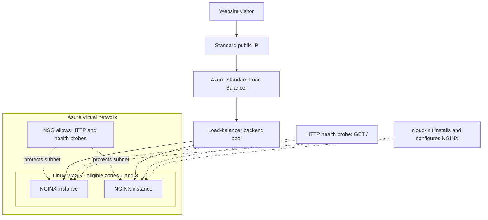

# Azure Auto-Healing Web Tier

Infrastructure-as-code technical assessment for Johns Lyng Group.

## Goal

Deploy a static NGINX web tier that remains available when one virtual machine becomes unhealthy or is deleted. Azure must automatically restore the environment to two working instances without requiring manual configuration.

## Why Azure

I chose Azure because it is relevant to the Microsoft-focused environment associated with the role, and its native services map directly to the assessment requirements. Virtual Machine Scale Sets maintain the web instances, Standard Load Balancer distributes traffic and checks their health, and automatic instance repair replaces an unhealthy instance without additional recovery software.

Using an existing Azure subscription also allowed me to check regional SKU availability, validate the Terraform configuration and produce a realistic deployment plan rather than designing the solution only on paper.

Australia East was selected because the required Basv2 VM quota, SKU and availability zones were verified there for this subscription. Australia Southeast is geographically closer to Melbourne, but Australia East provides the verified capacity needed for this assessment.

## Architecture



Website visitors connect only to the load balancer’s public IP address. The VM instances use private addresses inside the web subnet and do not receive individual public IP addresses.

The load balancer checks `http://<instance>/` on port 80. If NGINX stops returning a successful response, the load balancer removes that instance from traffic while the other instance continues serving the website. VM Scale Set automatic instance repair then replaces the unhealthy instance after its startup grace period.

A fixed autoscale profile keeps the minimum, default and maximum capacity at two instances. If an instance is deliberately deleted, Azure restores the scale set to two instances. Every new instance runs the same cloud-init configuration, installs NGINX and joins the existing load-balancer backend pool automatically.

Zones 1 and 3 are configured as eligible placement zones. Strict zone balancing is disabled so Azure can prioritise restoring the scale set to two instances if one zone temporarily cannot accept a replacement.

## Requirements coverage

| Requirement | Implementation |
| --- | --- |
| Self-healing | The load balancer probe detects an unhealthy web service. VM Scale Set automatic repair uses the probe result and replaces the unhealthy instance. |
| Deleted-instance recovery | An Azure Monitor autoscale profile enforces a minimum capacity of two and restores the count if an instance is deleted. |
| Self-provisioning | Terraform creates the resource group, network, security rules, load balancer, VM Scale Set, autoscale configuration and NGINX setup. No manual resource creation is required. |
| Idempotency | Terraform manages the desired state. After deployment, a second plan should report no infrastructure changes. |
| N + 1 capacity | The scale set maintains two instances behind the load balancer. Each instance is sized to support the complete assumed static-site workload while the other instance is replaced. |
| Static website | cloud-init installs NGINX and writes the web page whenever Azure creates an instance. |
| Naming and tagging | Resources follow a consistent type-project-environment naming pattern and share the Project, Environment and ManagedBy tags. |

## Prerequisites

The following tools and access are required:

- Terraform compatible with the version constraint defined in `versions.tf`.
- Azure CLI.
- An Azure subscription with permission to create the planned resources.
- The `Microsoft.Compute`, `Microsoft.Network` and `Microsoft.Insights` resource providers registered.
- At least four Basv2-family vCPUs available in Australia East.

Authenticate and confirm the selected subscription:

```powershell
az login
az account show --query "{Name:name, State:state}" --output table
```

If more than one subscription is available, select the correct one:

```powershell
az account set --subscription "<subscription-id>"
```

## Initialise and validate

Download the provider and initialise the local modules:

```powershell
terraform init
```

Check the formatting and validate the configuration:

```powershell
terraform fmt -check -recursive
terraform validate
```

## Create a deployment plan

```powershell
terraform plan -out=tfplan
```

The current configuration should propose 13 resources:

```text
Plan: 13 to add, 0 to change, 0 to destroy.
```

The saved plan is ignored by Git because it can contain environment-specific or sensitive values.

## Deploy

Provisioning is optional for this assessment. To deploy the reviewed plan:

```powershell
terraform apply tfplan
```

Alternatively, after initialisation, the complete environment can be created directly with:

```powershell
terraform apply
```

Terraform prompts for confirmation before creating the resources. No manual resource creation through the Azure Portal is required.

## View the website

Display the generated URL:

```powershell
terraform output -raw website_url
```

Test the endpoint:

```powershell
$websiteUrl = terraform output -raw website_url
Invoke-WebRequest -Uri $websiteUrl -UseBasicParsing
```

A healthy deployment should return HTTP status `200`.

## Verify idempotency

Run another plan without changing the configuration or deployed infrastructure:

```powershell
terraform plan -detailed-exitcode
$LASTEXITCODE
```

Exit code `0` means no changes were detected. Exit code `2` means Terraform detected changes, while exit code `1` indicates an error.

## Continuous integration

The GitHub Actions workflow in `.github/workflows/terraform.yml` runs when code is pushed to `main`, when a pull request targets `main`, or when it is started manually.

The workflow checks Terraform formatting, initialises the providers without configuring a state backend, and validates the configuration. It does not run `terraform plan` or `terraform apply`, so it does not require Azure credentials and cannot create or change Azure resources.

## Test one instance failure

Run the following request loop in a separate PowerShell terminal. Stop it with `Ctrl+C` after testing is complete.

```powershell
$websiteUrl = terraform output -raw website_url

while ($true) {
    try {
        $response = Invoke-WebRequest `
            -Uri $websiteUrl `
            -UseBasicParsing `
            -TimeoutSec 5

        "$(Get-Date -Format T) - HTTP $($response.StatusCode)"
    }
    catch {
        "$(Get-Date -Format T) - Request failed"
    }

    Start-Sleep -Seconds 5
}
```

### Test deleted-instance recovery

Get the resource names and select one instance:

```powershell
$resourceGroup = terraform output -raw resource_group_name
$scaleSet = terraform output -raw vm_scale_set_name

az vmss list-instances `
    --resource-group $resourceGroup `
    --name $scaleSet `
    --query "[].{InstanceId:instanceId, ProvisioningState:provisioningState}" `
    --output table

$instanceId = az vmss list-instances `
    --resource-group $resourceGroup `
    --name $scaleSet `
    --query "[0].instanceId" `
    --output tsv
```

Delete the selected instance:

```powershell
az vmss delete-instances `
    --resource-group $resourceGroup `
    --name $scaleSet `
    --instance-ids $instanceId
```

The surviving instance should continue serving the website. The autoscale minimum of two causes Azure to create another instance.

Check the instance count:

```powershell
az vmss list-instances `
    --resource-group $resourceGroup `
    --name $scaleSet `
    --query "length(@)" `
    --output tsv
```

Wait until the instance count returns to two and both instances are healthy before performing another failure test.

### Test unhealthy-instance repair

After the deletion test has recovered completely, select one current instance and stop NGINX through Azure Run Command:

```powershell
$instanceId = az vmss list-instances `
    --resource-group $resourceGroup `
    --name $scaleSet `
    --query "[0].instanceId" `
    --output tsv

az vmss run-command invoke `
    --resource-group $resourceGroup `
    --name $scaleSet `
    --instance-id $instanceId `
    --command-id RunShellScript `
    --scripts "sudo systemctl stop nginx"
```
Detailed deployment and failure-test results are available in [Runtime validation](docs/runtime-validation.md).

The HTTP probe should remove the unhealthy instance from load-balancer traffic. After the configured grace period, automatic instance repair replaces it and cloud-init installs NGINX on the replacement.

The deletion and unhealthy-service tests must be performed separately. The design tolerates one failed instance, not two simultaneous failures.

## Assumptions and estimated cost

This estimate uses a 31-day month containing 744 hours. I used the longest normal month so that the result does not rely on the lower 730-hour monthly average.

The Azure subscription used for this assessment has the following 12-month free-service allowances:

- 750 hours of B2ats v2 Linux VM usage.
- Two 64 GB P6 managed disks.
- 750 hours of Standard Load Balancer usage, up to five rules and 15 GB of data processing.

The 750 VM hours are shared by all B2ats v2 instances. Two instances running for 744 hours consume 1,488 VM hours, leaving 738 billable hours after the allowance is applied.

| Resource | Monthly calculation | Estimated cost |
| --- | --- | ---: |
| Two `Standard_B2ats_v2` instances | `(2 × 744 − 750) × AUD 0.0165` | AUD 12.18 |
| Two 64 GB P6 Premium SSD disks | Both included in the free-service allowance | AUD 0.00 |
| Standard Load Balancer | 744 hours, two rules and less than 15 GB processed | AUD 0.00 |
| Standard static public IPv4 address | `744 × AUD 0.007` | AUD 5.21 |
| Virtual network, subnet, NSG, VMSS and autoscale configuration | No separate management charge | AUD 0.00 |
| **Estimated subtotal** | | **AUD 17.39** |
| **Estimated total including 10% GST** | | **AUD 19.13** |

The estimate therefore remains below the AUD 20 monthly target while the verified 12-month Azure free-service benefits are active.

The estimate assumes:

- The account remains eligible for the verified 12-month free services.
- Website traffic stays within the included Load Balancer data-processing and bandwidth allowances.
- Disk activity stays within the included P6 operation allowance.
- No additional services such as Azure Bastion, NAT Gateway, Log Analytics or a custom DNS zone are added.
- All resources remain deployed for the full month.

Prices were checked in Australian dollars on 25 September 2026. Azure prices and exchange rates can change. When the 12-month free-service period ends, this configuration will exceed the assessment budget and should be destroyed or redesigned rather than represented as a permanent production solution.

### Pricing sources

- [Azure free services](https://azure.microsoft.com/en-au/pricing/free-services/)
- [Azure Retail Prices API](https://learn.microsoft.com/en-us/rest/api/cost-management/retail-prices/azure-retail-prices)
- [Azure public IP address pricing](https://azure.microsoft.com/en-au/pricing/details/ip-addresses/)

The temporary USD 200 Azure credit is not deducted from this estimate because it does not represent an ongoing monthly saving.
## Destroy the lab

Remove the Azure resources when testing is complete to avoid further charges:

```powershell
terraform destroy
```

Review the proposed deletions and confirm when prompted.
